# 📋 Summary Report Skill — Trae IDE Skill

> 多项目通用的交互式项目审查报告生成器，支持 HTML 和 Markdown 两种输出格式，还可分析其他 Skill 的功能

[](https://github.com/luo-ci)
[](mailto:luociqaq@qq.com)
[](LICENSE)

## 这是什么？

这是一个 [Trae IDE](https://trae.ai) 的 Skill 插件。当你在项目中说 **"总结"** 时，它会自动检测你的技术栈，并行采集项目数据，然后生成一份 **交互式 HTML 审查报告** 或 **Markdown 格式报告**（用户可选择）。

报告包含12个板块：项目概览、系统架构、请求流程、功能表、API列表、文件列表、安全漏洞审查、逻辑问题、前后端匹配、优化建议、增量对比、优化路线图。每个板块可折叠展开，漏洞附带修复代码，路线图可勾选追踪进度。

此外，该 Skill 还支持 **分析其他 Skill** 的功能——读取目标 Skill 的 SKILL.md，生成结构化的功能分析报告，说明该 Skill 是做什么的、如何触发、核心功能、工作流程等。

**支持的框架**：9种后端（ThinkPHP/Laravel/Django/Spring Boot/Express/NestJS/Node.js/Go/Symfony）+ 5种前端（Vue3/Vue2/Next.js/React/Nuxt3），自动检测，无需手动配置。

## 报告长什么样？

### 📊 总览 — 所有板块折叠

打开报告时，12个板块默认折叠，左侧导航栏可快速跳转。点击任意标题即可展开查看详细内容。

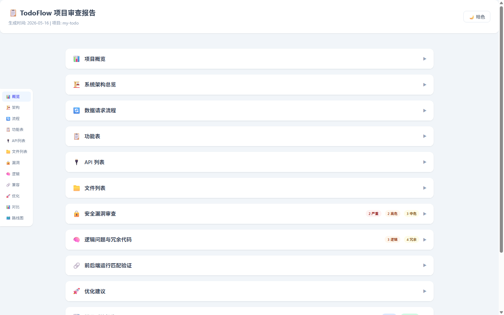

### 📊 项目概览 — 统计卡片 + 健康分数

展开后展示统计卡片（后端控制器数、前端视图数、数据库表数）和四维健康分数进度条：安全性、逻辑性、兼容性、代码质量。

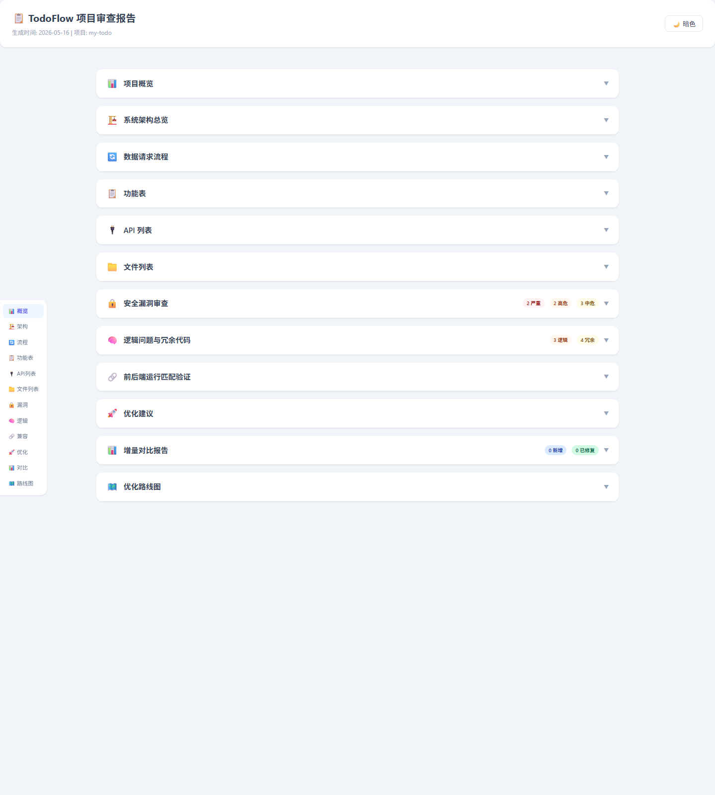

### 🏗️ 系统架构 — 分层架构图

Flexbox盒子布局的系统架构图，从上到下展示应用层、前端模块、后端中间件、数据层的分层关系和连接方式。

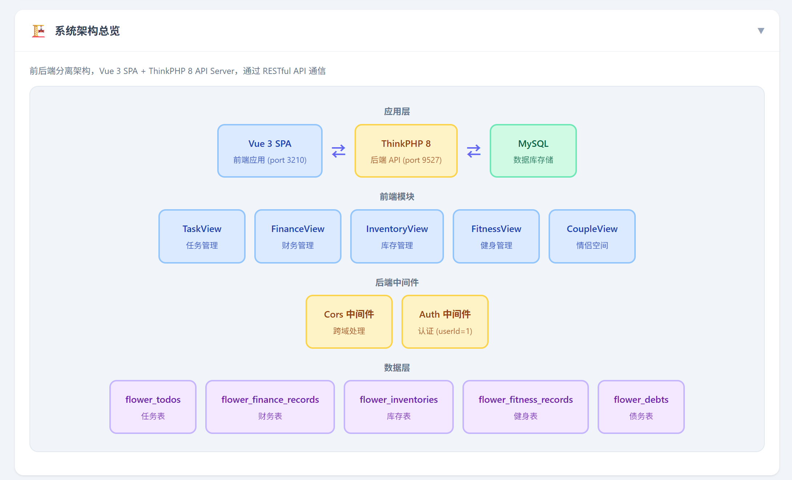

### 🔄 请求流程 — 完整生命周期

从用户操作到界面更新的完整请求流程图：Vue组件 → Pinia Store → Axios → 中间件 → Controller → 数据库 → 响应返回。

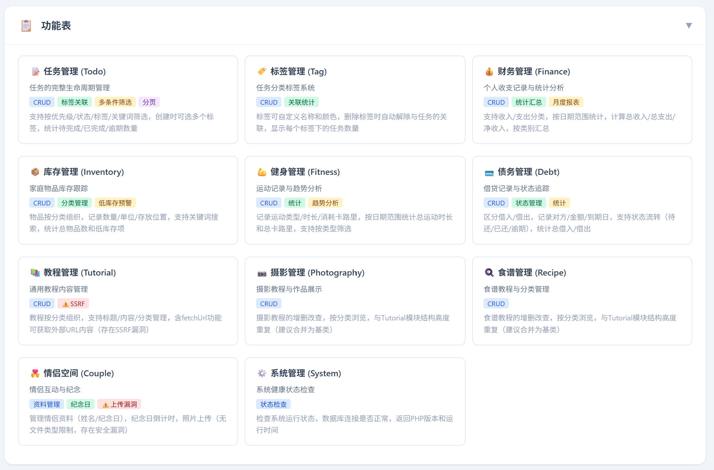

### 📋 功能表 — 模块卡片网格

每个功能模块一张卡片，包含功能描述、能力标签（CRUD/统计/筛选/安全警告）和详细说明。

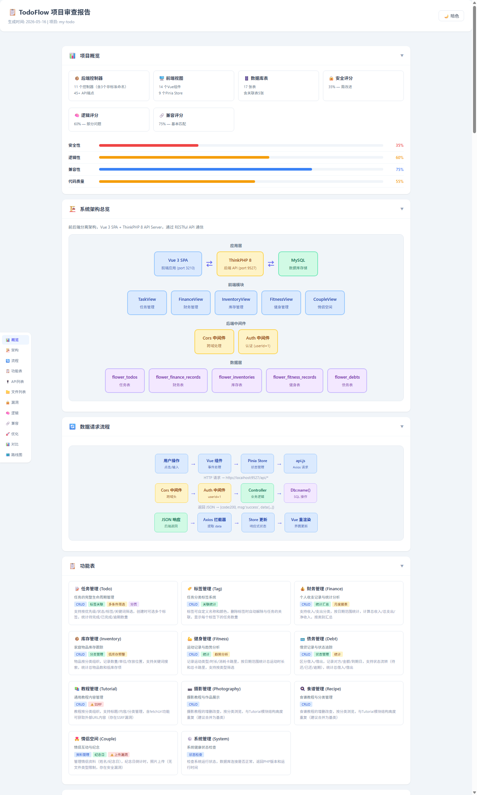

### 🔌 API列表 — 端点详情表格

完整的API端点表格，包含HTTP方法（颜色编码）、路径、功能描述、所属控制器。

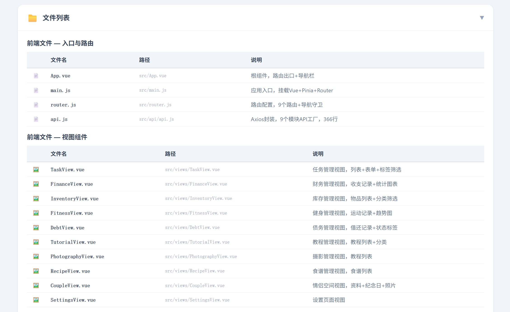

### 📁 文件列表 — 前后端文件完整清单

前端和后端所有文件的完整列表，包含文件图标、文件名、完整路径和功能说明，按类别分组。

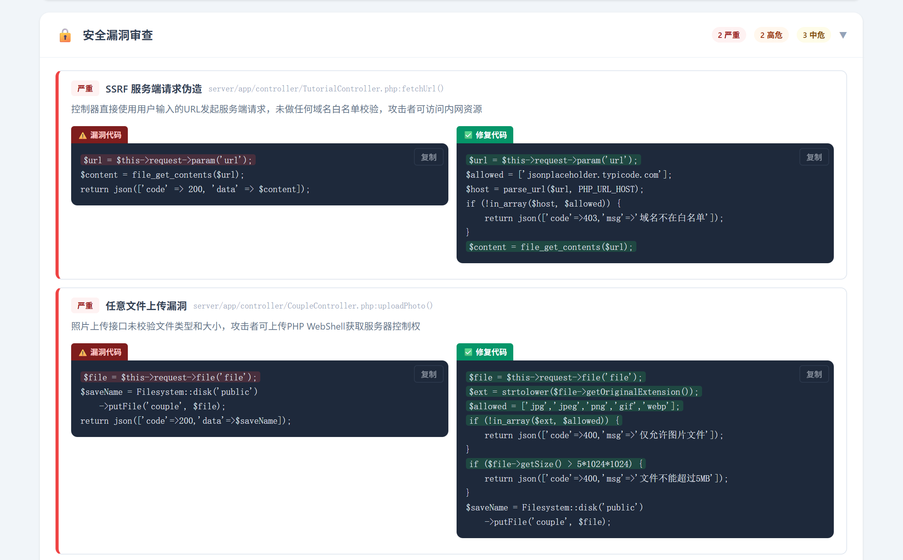

### 🔒 安全漏洞 — 漏洞代码 vs 修复代码

漏洞按严重性分级（严重/高危/中危），每个漏洞附带 **漏洞代码** 和 **修复代码** 双栏并排对比，关键行高亮标注。

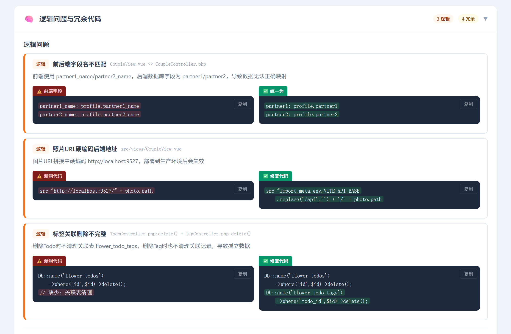

### 🧠 逻辑问题 — 逻辑缺陷 + 冗余代码

逻辑问题审查：字段不匹配、数据流错误、业务逻辑缺陷，以及冗余代码和孤立文件检测。

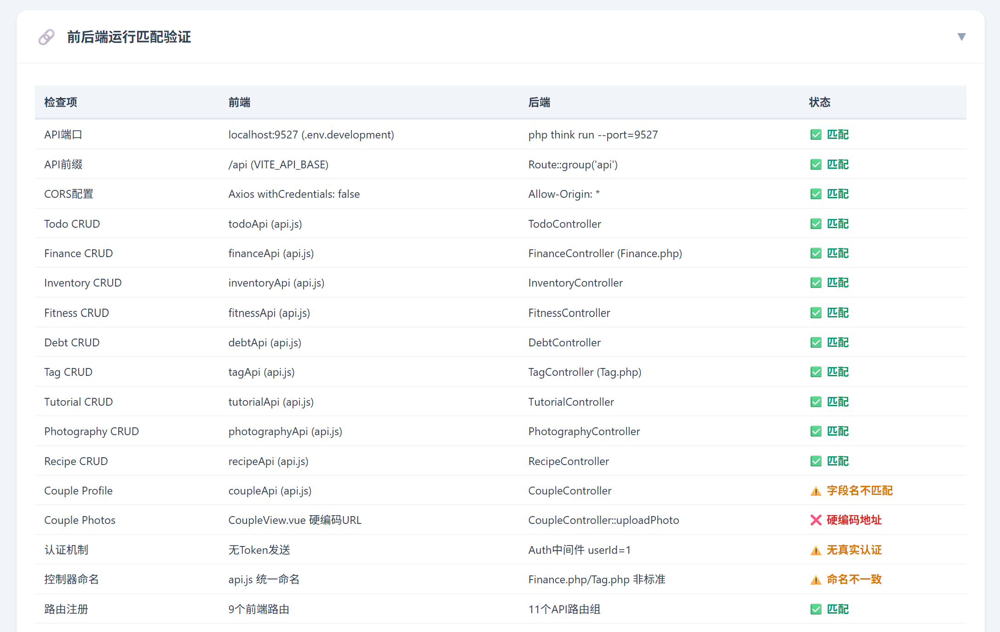

### 🔀 前后端匹配 — 兼容性验证

前后端模块兼容性验证表格，状态标注（匹配/警告/错误），检测API对齐、字段匹配、配置一致性。

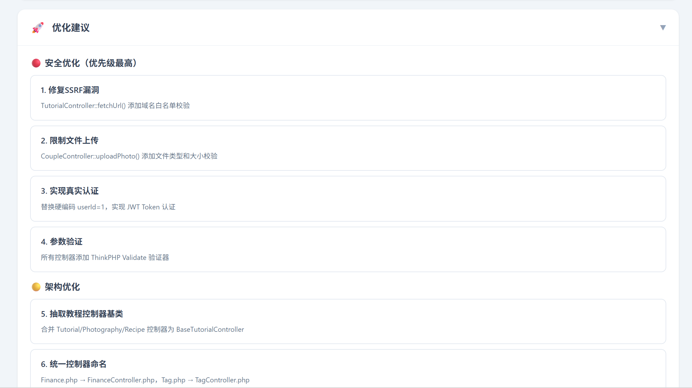

### 🚀 优化建议 — P0-P3优先级排序

按P0紧急→P3体验提升排序的优化建议卡片，每条包含影响范围和实施建议。

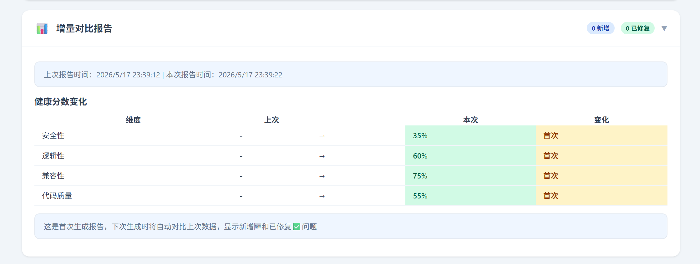

### 📌 优化路线图 — 可勾选追踪

分5个阶段（P0紧急→P3体验提升），checkbox勾选后进度条自动更新，状态持久化到 localStorage，刷新不丢失。

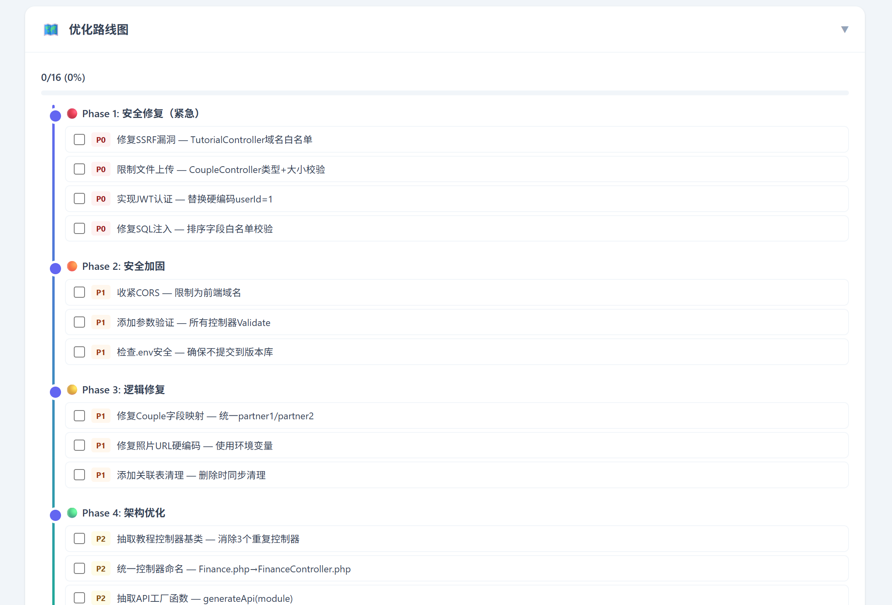

## 示例报告

仓库中包含一个示例报告文件 [summary-report_example.html](summary-report_example.html)，你可以下载后在浏览器中打开查看完整效果（需将 `report-assets/` 目录放在同目录下）。

## 核心特性

| 特性 | 说明 |
|------|------|
| 🔍 **自动框架检测** | 9种后端 + 5种前端框架自动识别，无需手动配置 |
| ⚡ **并行数据采集** | 4批次17路并行搜索，快速高效收集项目数据 |
| 📝 **双格式输出** | 支持 HTML（交互式）和 Markdown（纯文本）两种输出格式 |
| 🔒 **漏洞+修复并排** | Critical/High/Medium漏洞附漏洞代码和修复代码双栏对比 |
| 📌 **可勾选路线图** | 分阶段优化路线，checkbox勾选，进度自动更新并持久化 |
| 🌙 **暗色模式** | CSS变量驱动，一键切换，状态保存到localStorage |
| 📊 **增量对比** | 与上次报告对比，标记新增和已修复问题 |
| 🏗️ **架构图+流程图** | Flexbox盒子布局的系统架构图和数据请求流程图 |
| 📦 **多项目便携** | CSS/JS模板存储在skill目录，自动复制到目标项目 |
| 🔍 **Skill分析** | 可分析其他Skill的功能，生成结构化的功能说明报告 |

## 安装

将本仓库克隆到 Trae IDE 的 skills 目录下：

```bash
# 进入 Trae skills 目录
cd ~/.trae/skills   # macOS/Linux
cd %USERPROFILE%\.trae\skills   # Windows

# 克隆仓库
git clone https://github.com/Luociqvq/Summary-Report-Skill.git
```

安装后的目录结构：

```
.trae/skills/Summary-Report-Skill/
├── SKILL.md                    ← Skill 指令文件（Agent读取执行）
├── DOCS.html                   ← HTML格式使用文档
├── DOCS.md                     ← Markdown格式使用文档
├── summary-report_example.html ← 示例报告
├── screenshots/                ← 报告截图
└── report-assets/
    ├── report.css              ← CSS模板（布局/组件/暗色/打印/响应式）
    └── report.js               ← JS模板（折叠/路线图/主题/复制/排序/对比）
```

## 使用方法

### 触发方式

在 Trae IDE 的对话中输入以下任意触发词：

| 触发词 | 示例 |
|--------|------|
| `总结` | "帮我总结一下项目" |
| `生成总结` | "生成总结报告" |
| 审查请求 | "检查项目漏洞并生成报告" |
| `分析skill` | "分析这个skill是做什么的" |
| Skill分析 | "帮我分析一下xxx skill的功能" |

**注意**: 如果用户没有指定输出格式（HTML/Markdown），Skill 会自动询问用户选择。

### 工作流程

```
1️⃣ 框架检测 → 2️⃣ 格式选择 → 3️⃣ 交互选板 → 4️⃣ 并行采集 → 5️⃣ 生成报告 → 6️⃣ 输出文件
```

1. **框架检测** — 自动检测项目技术栈
2. **格式选择** — 若用户未指定格式，询问选择 HTML 或 Markdown
3. **交互选板** — 询问你需要哪些板块和审查深度
4. **并行采集** — 4批次17路并行搜索采集项目数据
5. **生成报告** — 按模板生成交互式HTML报告或Markdown报告
6. **输出文件** — 在项目根目录生成报告文件 + `report-assets/`（仅HTML模式）

### 输出文件

```
{your-project}/
├── summary-report.html         ← 最终报告（引用外部CSS/JS）
└── report-assets/
    ├── report.css              ← 报告样式
    └── report.js               ← 报告交互逻辑
```

## 框架适配

### 支持的后端框架

| 框架 | 指示文件 |
|------|---------|
| ThinkPHP | `server/think` + `server/app/controller/` |
| Laravel | `app/Http/Controllers/` + `artisan` |
| Symfony | `src/Controller/` + `composer.json` |
| Django/Flask | `manage.py` / `app.py` + `views.py` |
| Spring Boot | `src/main/java/` + `pom.xml` |
| Express | `app.js` + `package.json`(express) |
| NestJS | `nest-cli.json` + `src/index.ts` |
| Node.js | `server/` + `package.json` |
| Go | `main.go` + `go.mod` |

### 支持的前端框架

| 框架 | 指示文件 |
|------|---------|
| Vue 3 + Vite | `vite.config.js` + `src/*.vue` |
| Vue 2 + Webpack | `vue.config.js` + `src/*.vue` |
| Next.js | `next.config.js` + `src/app/` |
| React CRA | `react-scripts` in `package.json` |
| Nuxt 3 | `nuxt.config.ts` + `app.vue` |

## 报告板块一览

| 板块 | 内容 |
|------|------|
| 📊 概览 | 统计卡片 + 健康分数进度条 |
| 🏗️ 架构 | Flexbox系统架构图 |
| 🔄 流程 | 请求生命周期流程图 |
| 📋 功能表 | 模块卡片 + 能力标签 |
| 🔌 API列表 | 方法+路径+功能+参数表格 |
| 📁 文件列表 | 前后端文件完整表格 |
| 🔒 漏洞 | 严重性卡片 + 漏洞/修复代码并排 |
| 🧠 逻辑 | 逻辑问题 + 冗余代码审查 |
| 🔀 匹配 | 前后端兼容性验证 |
| 🚀 优化 | P0-P3优先级优化建议 |
| 📊 对比 | 增量对比（与上次报告比较） |
| 📌 路线图 | 可勾选任务 + 自动进度条 |

## 自定义

### 修改报告样式

编辑 `report-assets/report.css` 中的 CSS 变量：

```css
:root {
  --bg: #f8fafc;        /* 页面背景 */
  --card: #fff;         /* 卡片背景 */
  --primary: #6366f1;   /* 主色调 */
  --radius: 12px;       /* 圆角大小 */
}
```

### 添加新框架支持

在 `SKILL.md` 的框架检测表和搜索关键词映射表中添加新行即可。

## 文档

- [DOCS.html](DOCS.html) — 交互式HTML格式使用文档（推荐）
- [DOCS.md](DOCS.md) — Markdown格式使用文档

## 许可证

[MIT License](LICENSE)

## 作者

**Luoci**

- 📧 Email: [luociqaq@qq.com](mailto:luociqaq@qq.com)
- 🐙 GitHub: [https://github.com/luo-ci](https://github.com/luo-ci)
