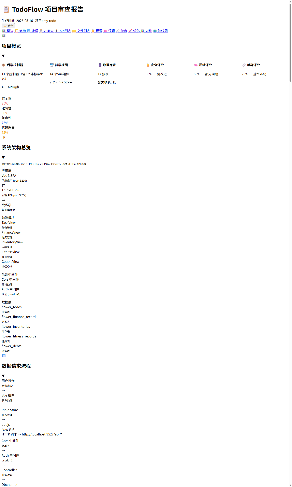
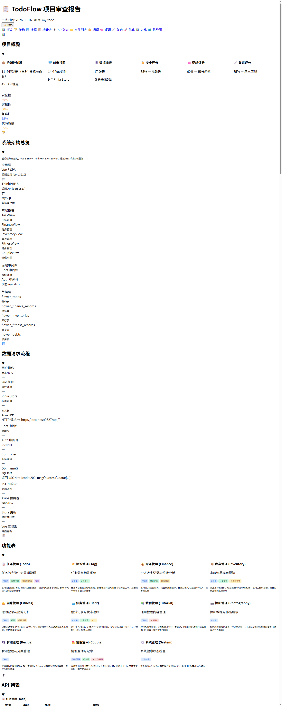

# 📋 HTML Summary Report — Trae IDE Skill

> 多项目通用的交互式项目审查报告生成器

[](https://github.com/luo-ci)
[](mailto:luociqaq@qq.com)
[](LICENSE)

一个用于 [Trae IDE](https://trae.ai) 的 Skill 插件，当用户说"总结"时自动生成交互式 HTML 项目审查报告。支持 **9种后端 + 5种前端框架** 自动检测，**17路并行数据采集**，生成包含安全漏洞、逻辑问题、运行匹配、优化建议的完整报告。

## ✨ 特性

| 特性 | 说明 |
|------|------|
| 🔍 **自动框架检测** | 9种后端（ThinkPHP/Laravel/Django/Spring Boot/Express/NestJS/Go等）+ 5种前端框架自动识别 |
| ⚡ **并行数据采集** | 4批次17路并行搜索，快速高效收集项目数据 |
| 🔒 **漏洞+修复并排** | Critical/High/Medium漏洞附漏洞代码和修复代码双栏对比 |
| 🗺️ **可勾选路线图** | 分阶段优化路线，checkbox勾选，进度自动更新并持久化 |
| 🌙 **暗色模式** | CSS变量驱动，一键切换，状态保存到localStorage |
| 📊 **增量对比** | 与上次报告对比，标记新增🆕和已修复✅问题 |
| 🏗️ **架构图+流程图** | Flexbox盒子布局的系统架构图和数据请求流程图 |
| 📦 **多项目便携** | CSS/JS模板存储在skill目录，自动复制到目标项目 |

## 📸 截图

### 概览面板（默认折叠）


### 展开视图 — 概览+架构+功能表


### 安全漏洞审查 — 漏洞代码/修复代码并排对比


### 暗色模式


## 🚀 安装

将本仓库克隆到 Trae IDE 的 skills 目录下：

```bash
# 进入 Trae skills 目录
cd ~/.trae/skills   # macOS/Linux
cd %USERPROFILE%\.trae\skills   # Windows

# 克隆仓库
git clone https://github.com/luo-ci/html-summary-report.git
```

安装后的目录结构：

```
.trae/skills/html-summary-report/
├── SKILL.md                    ← Skill 指令文件（Agent读取执行）
├── DOCS.html                   ← HTML格式使用文档
├── DOCS.md                     ← Markdown格式使用文档
├── report-assets/
│   ├── report.css              ← CSS模板（布局/组件/暗色/打印/响应式）
│   └── report.js               ← JS模板（折叠/路线图/主题/复制/排序/对比）
└── screenshots/                ← 演示截图
```

## 📖 使用方法

### 触发方式

在 Trae IDE 的对话中输入以下任意触发词：

| 触发词 | 示例 |
|--------|------|
| `总结` | "帮我总结一下项目" |
| `生成总结` | "生成总结报告" |
| HTML格式审查请求 | "检查项目漏洞并生成HTML报告" |

### 工作流程

```
1️⃣ 框架检测 → 2️⃣ 交互选板 → 3️⃣ 并行采集 → 4️⃣ 生成HTML → 5️⃣ 输出报告
```

1. **框架检测** — 自动检测项目技术栈（ThinkPHP/Laravel/Django/Spring Boot/Express/NestJS/Go等）
2. **交互选板** — 询问你需要哪些板块和审查深度
3. **并行采集** — 4批次17路并行搜索采集项目数据
4. **生成HTML** — 按模板生成交互式HTML报告
5. **输出报告** — 在项目根目录生成 `summary-report.html` + `report-assets/`

### 输出文件

```
{your-project}/
├── summary-report.html         ← 最终报告（引用外部CSS/JS）
└── report-assets/
    ├── report.css              ← 报告样式
    └── report.js               ← 报告交互逻辑
```

## 🏗️ 框架适配

Skill 会自动检测项目的技术栈，并动态调整搜索关键词和目录路径：

### 支持的后端框架

| 框架 | 指示文件 |
|------|---------|
| ThinkPHP | `server/think` + `server/app/controller/` |
| Laravel | `app/Http/Controllers/` + `artisan` |
| Symfony | `src/Controller/` + `composer.json` |
| Django/Flask | `manage.py` / `app.py` + `views.py` |
| Spring Boot | `src/main/java/` + `pom.xml` |
| Express | `app.js` + `package.json`(express) |
| NestJS | `nest-cli.json` + `src/index.ts` |
| Node.js | `server/` + `package.json` |
| Go | `main.go` + `go.mod` |

### 支持的前端框架

| 框架 | 指示文件 |
|------|---------|
| Vue 3 + Vite | `vite.config.js` + `src/*.vue` |
| Vue 2 + Webpack | `vue.config.js` + `src/*.vue` |
| Next.js | `next.config.js` + `src/app/` |
| React CRA | `react-scripts` in `package.json` |
| Nuxt 3 | `nuxt.config.ts` + `app.vue` |

## 📋 报告板块

| 板块 | 内容 |
|------|------|
| 📊 概览 | 统计卡片 + 健康分数进度条 |
| 🏗️ 架构 | Flexbox系统架构图 |
| 🔄 流程 | 请求生命周期流程图 |
| 📋 功能表 | 模块卡片 + 能力标签 |
| 🔌 API列表 | 方法+路径+功能+参数表格 |
| 📁 文件列表 | 前后端文件完整表格 |
| 🔒 漏洞 | 严重性卡片 + 漏洞/修复代码并排 |
| 🧠 逻辑 | 逻辑问题 + 冗余代码审查 |
| 🔗 匹配 | 前后端兼容性验证 |
| 🚀 优化 | P0-P3优先级优化建议 |
| 📊 对比 | 增量对比（与上次报告比较） |
| 🗺️ 路线图 | 可勾选任务 + 自动进度条 |

## 🎨 自定义

### 修改报告样式

编辑 `report-assets/report.css` 中的 CSS 变量：

```css
:root {
  --bg: #f8fafc;        /* 页面背景 */
  --card: #fff;         /* 卡片背景 */
  --primary: #6366f1;   /* 主色调 */
  --radius: 12px;       /* 圆角大小 */
}
```

### 添加新框架支持

在 `SKILL.md` 的框架检测表和搜索关键词映射表中添加新行即可。

## 📄 文档

- [DOCS.html](DOCS.html) — 交互式HTML格式使用文档（推荐）
- [DOCS.md](DOCS.md) — Markdown格式使用文档

## 📜 许可证

[MIT License](LICENSE)

## 👤 作者

**Luoci**

- 📧 Email: [luociqaq@qq.com](mailto:luociqaq@qq.com)
- 🐙 GitHub: [https://github.com/luo-ci](https://github.com/luo-ci)
